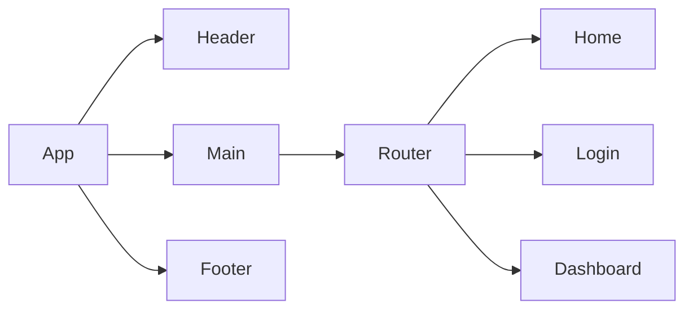

*A PRD (Product Requirements Document) is created before creating a product or feature and includes the planning required for developers to execute effectively. This document is usually prepared by Product Managers, read more [here](https://www.atlassian.com/agile/product-management/requirements)*

# Product Requirements Documentation

**Summary**
| Field | Detail |
|-------|--------|
| Project Name | I-Commerce Application|
| Description | The app is an ecommerce platform that allows users to browse products, add them to their cart, and place orders, while also providing admin functionalities for managing products and orders.  |
| Developers | {Izzy Zinxhirija} |
| Live Website |  |
| Repo | https://github.com/Izzy-2023/seir-seal-unit4-project4-backend |

## Problem Being Solved and Target Market

Use this area to explain what problem your app is solving, and who are the people who have this problem.

## User Stories

List of stories users should experience when using your application.

- Users should be able to see the site on desktop and mobile
- Users can create an account
- Users can sign in to their account
- Users can create a new item
- Users can see all their items on the dashboard
- Users can update items
- User can delete items

## ERD (Entity Relationship Diagram)

| Field Name | Type | Description |
| ---------- | ---- | ----------- |
| id | Integer | Primary key |
| entity_type | CharField | Type of entity |
| name | CharField | Name of the entity |
| description | TextField | Description of the entity |
| price | DecimalField | Price of the entity (for products and order items) |
| image_url | URLField | URL of the image (for products) |
| total_price | DecimalField | Total price of the order (for orders) | 
| created_at | DateTimeField | Date and time when the entity was created | 
| user_id |	IntegerField | ID of the user (for orders and order items) | 
| quantity | IntegerField | Quantity of the entity (for order items) |
| username | CharField	| Username of the user (for users) |
| email	| EmailField | Email of the user (for users) |
| password | CharField | Password of the user (for users) |
| is_admin | BooleanField | Indicates if the user is an admin (for users) |

## Route Tables

For backend Applications you'll want to detail the different routes and types of your request your server can receive. There are three main things to define.

- The endpoint: the URL to which the request must be made
- The method: the type of http method the request should be
- The response: what the response should be, a web page, json data, etc.

You should also include any additional notes on any special headers that may be used and so forth.

|Route Name | Endpoint | Method | Description |
|---------- | -------- | ------ | ----------- |
| List Products | /products/ | GET | Retrieve a list of all products |
| Create Product | /products/ |	POST | Create a new product |
| Retrieve Product | /products/{id}/ | GET | Retrieve details of a specific product |
| Update Product | /products/{id}/ | PUT | Update details of a specific product |
| Delete Product | /products/{id}/ | DELETE	| Delete a specific product |
| List Orders | /orders/ | GET | Retrieve a list of all orders |
| Create Order | /orders/ | POST | Create a new order | 
| Retrieve Order | /orders/{id}/ | GET | Retrieve details of a specific order | 
| Update Order | /orders/{id}/ | PUT | Update details of a specific order |
| Delete Order | /orders/{id}/ | DELETE	| Delete a specific order |
| Signup | /auth/signup | POST |creates new user account returns user JSON | 
| Login | /auth/login | POST |logs in user and returns user JSON |

## Component Architecture

You can use the [Mermaid Markdown Syntax](https://mermaid-js.github.io/mermaid/#/flowchart) to create a chart of how the parts of your frontend website relate to each other. Units should represent components of your page. The following is an example you may see in a Single Page Application like a React App.

## User Interface Mockups

Use tooks like [Figma](https://www.figma.com/), [Mockflow](https://www.mockflow.com/) or [UXPIN](https://www.uxpin.com/). If you need inspiration visit a site like [Behance](https://www.behance.net/?tracking_source=typeahead_search_direct&search=web%20mockup). 

